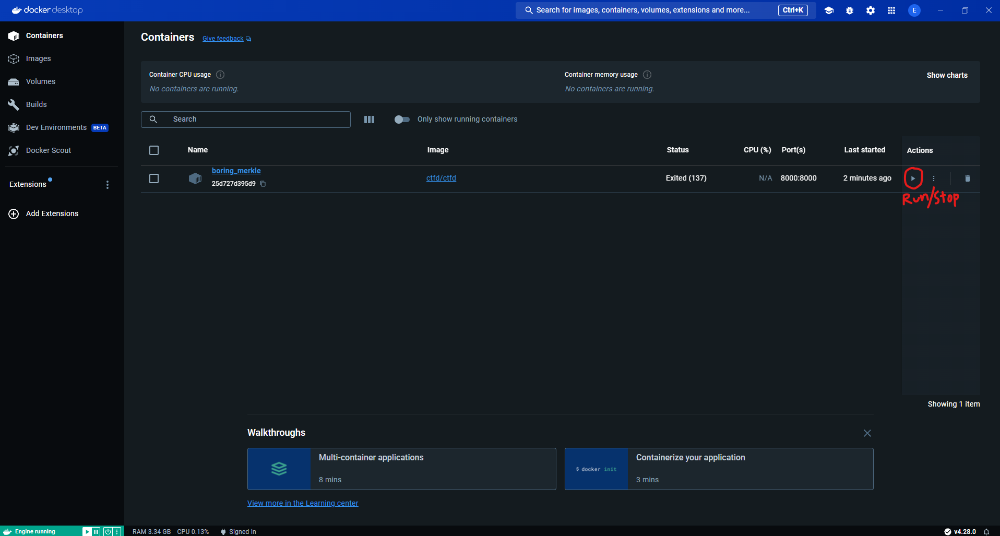
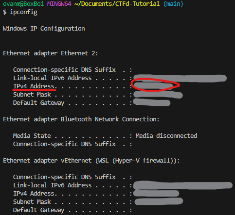

# Table of Contents
1. [Introduction](#introduction)
2. [Installation](#installation)
3. [Hosting Locally](#hosting-locally)
4. [Self Hosting](#self-hosting)
5. [Hosting Through CTFd](#hosting-remotely-through-ctfd)
6. [Setup](#setup)

# Introduction

CTFd is an easy capture the flag framework. This tutorial will guide you through the steps of setting up a CTFd server. The CTFd code can be found [here](https://github.com/CTFd/CTFd). Official online documentation can be found [here](https://docs.ctfd.io).

Your first step will be deciding how to host your server. You have a few options when it comes to hosting:

1. Because CTFd is open source, hosting locally is 100% free. This allows anyone on your network to access your CTF.

2. You can also self host publicly, but you will want your own computer to use as a server, and will need to pay if you want a domain name. This is also a fairly complicated option.

3. The easist option to host publicly is through CTFd itself. You can get a ctfd.io URL. The only downside is this will cost $10 monthly.

If you want to host through CTFd, you can skip installation and head straight to [Hosting Remotely Through CTFd](#hosting-remotely-through-ctfd).

If you choose options 1 and 2 and want to host the server yourself, continue to the installation section.

# Installation

The first step is to clone this repository. If you are new to using SSH, you can access [this](https://docs.github.com/en/authentication/connecting-to-github-with-ssh/managing-deploy-keys#set-up-deploy-keys) tutorial for help setting up a key.

Clone this repository with the following command:
```sh
git clone https://github.com/evanmarlo/CTFd-Tutorial.git
```
Change directories into the submodule:
```sh
cd CTFd
```
Clone the CTFd submodule. It is not necessary to understand submodules to set this up, but if you are unfamiliar with submodules you can learn more [here](https://git-scm.com/book/en/v2/Git-Tools-Submodules).
```
git submodule init
git submodule update
```
Then install dependencies (might take a minute, if you have python 3 and python 2 installed, you might need to use pip3):
```sh
pip install -r requirements.txt
```

Next, you will need to install Docker [here](https://docs.docker.com/install/).

If you do not already have Docker Compose installed, install it [here](https://docs.docker.com/compose/install/).

# Hosting Locally
Start Docker with the following command:
```
docker run -p 8000:8000 -it ctfd/ctfd
```

While docker is running, open up the following URL in a web browser:
http://localhost:8000/setup

From there you can follow the [Setup](#setup) instructions to setup your CTF. When you are done you can close the container through the terminal by pressing control + c. You can also run and close your container through the docker desktop app. This is how you will save changes to your CTF. Alternatively, you can [export entire CTFd instance data](https://docs.ctfd.io/docs/exports/ctfd-exports). See the screenshot below.



In order for to share your CTF with other devices on your network, you will need to know your IP address. If you are on Windows and don't know your machine's IP address already, run the following:
```
ipconfig
```
If you are on Mac or Linux, use the ```ifconfig``` command. Your IP address will be at "IPv4 Address". Here is a screenshot example:



Then, share the following link, replacing "ipaddress" with your own IP address: http://ipaddress:8000

For example, if my IP address were 123.45.678.9, I would share the link http://123.45.678.9:8000.

From here, if you all you want to do is host locally, you can skip to the [Setup](#setup) section.

# Self Hosting

First, you will want a (probably Linux) machine to act as your server and run your server.

Your first step to self hosting will be getting a domain name. You can usually get a domain name fairly cheap through a registrar. I can't recomend one specifically but some examples you can use are Wix, GoDaddy, Mailchimp, or AWS.

If you are really interested in setting up the domain name yourself, [here](https://blog.technitium.com/2022/06/how-to-self-host-your-own-domain-name.html) is an article that details how you may do that.

Once you have your domain name setup, you can host it with docker. Here is a useful [repo](https://github.com/3Nigma/dsdr-setup) that comes with an article that details how to host with docker.

# Hosting Remotely Through CTFd
Hosting through CTFd is easy and intuitive. If you would like an educational discount, you can fill out their [contact form](https://ctfd.io/contact/).

Once you have setup the educational discount, head to their [pricing page](https://ctfd.io/pricing/) and select a plan, and create a new instance.

# Setup
Once you have your server setup, CTFd has a great [tutorial](https://docs.ctfd.io/tutorials/getting-started/) on how to setup your challenges.